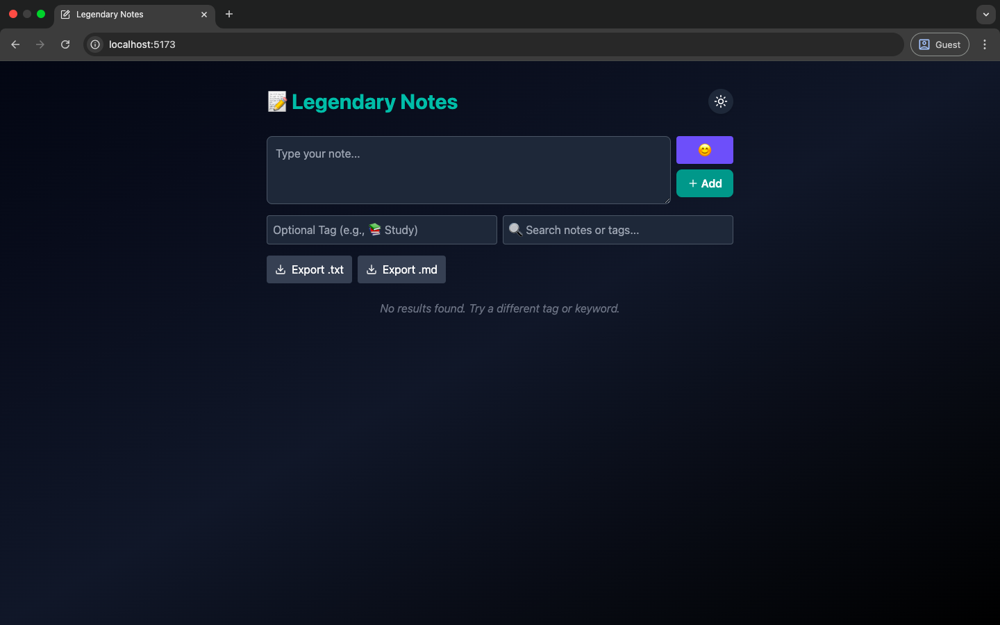

### 📝 Legendary Notes — React Project (Frontend Only)
⚛️ A beautiful and fully responsive Notes App built using React + TailwindCSS with features like tagging, emoji support, pinning, dark mode, and localStorage — no backend required.

### 🔥 Live Demo
🔗 Watch the Full YouTube Build https://shorturl.at/AN7Go
🎥 Code, design, and polish — all explained step-by-step.

### ✨ Features
🧠 Smart Note Taking
Clean UI with paragraph support, smart tagging, and search.

### 🕶️ Dark Mode Toggle
Save your eyes and your style — remembers your theme preference.

### 📌 Pin & Unpin Notes
Prioritize important notes with a single click.

### 😊 Emoji Picker
Add expressive emojis to any note (via emoji-picker-react).

### 🔍 Search & Filter
Filter notes by text or tag with real-time updates.

### 📁 Export Notes
Save your notes as .txt or .md (Markdown format).

### 💾 LocalStorage Powered
Your data is saved — even after refresh or closing the tab.

### 🚀 Tech Stack
Tool	Purpose
React	Frontend framework
React (Vite)	Frontend framework
Tailwind CSS	Styling with utility classes
Lucide Icons	Icons for buttons and UI
Framer Motion	Smooth animations (optional)
Emoji Picker	Emoji input support
LocalStorage	Save notes & theme persistently

### 📦 Installation
```bash
Clone the repository and install dependencies:
git clone https://github.com/jimmy-oss/legendary-note-app
cd legendary-notes
npm install
npm run dev

📂 Folder Structure
css
/src
  ├── components/
  ├── App.jsx
  ├── index.css
  └── main.jsx
```
### 💡 Future Ideas
✅ Markdown rendering

✅ Drag and drop notes

🔒 Authentication

☁️ Cloud sync (Firebase / Supabase)

🧠 AI-assisted smart suggestions

### 📸 Screenshots
🧭 Home Page


### 🤝 Support Jimmyoss
If this project helped you, consider:

⭐ Starring on GitHub

🧃 Buy me a coffee

🧠 Subscribing to YouTube — Jimmyoss007

### 📢 License
MIT — Feel free to use, modify, and build on this project.

